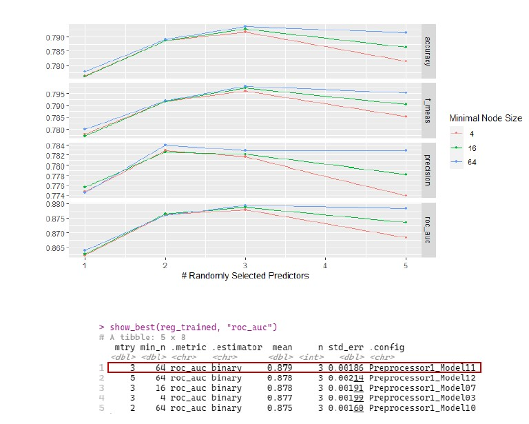

# Estudos de python

<!-- badges: start -->

<!-- badges: end -->

Backup dos estudos de python

## 

## Algoritimos de ML

#### Randon forest peformace

## Teste de MPL

Tetando MLP

Acuracia base de teste MLP

    accuracy_score = 0.7160

\`
